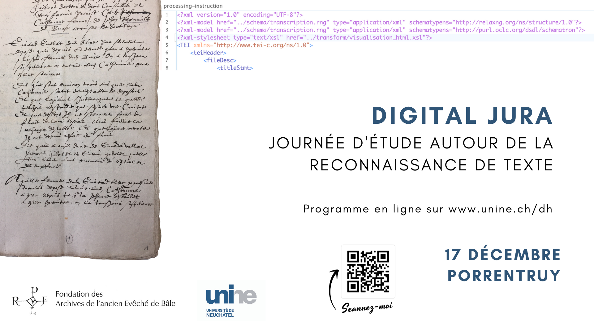

# DigitalJura
Journée d'étude HTR du 17 décembre 2021
Organisée par l'Université de Neuchâtel en partenariat avec les archives de l'ancien Évêché de Bâle et l'Université de Genève.

## Programme de la journée 
[Programme en ligne](https://www.unine.ch/dh/home/digital-jura.html)

Horaire | activité
---|---
9h-9h15 | accueil
9h15-9h45 | présentation des Archives de l'ancien Évêché de Bâle et de son projet de numérisation (Jean-Claude Rebetez)
9h45-10h45 | présentation "Segmentation de l’image" (Simon Gabay)
10h45-11h00 | pause
11h00-12h00 | atelier de segmentation sur manuscrits (Simon Gabay)
12h00-13h30 | repas
13h30-14h30 | présentation "HTR - Handwritten Text Recognition" (Simon Gabay)
14h30-14h45 | pause
14h45-15h45 | atelier FoNDUE (Simon Gabay)
15h45-16h00 | pause
16h00-17h00 | atelier Transkribus (Élodie Paupe)
17h00-17h30 | bilan 
 
La journée se déroule au Lycée cantonal à Porrentruy (Place Blarer-de-Wartensee 2, Porrentruy) dans la salle D08 (troisième étage, emprunter les escaliers face à l'entrée principale).

Le repas de midi sera pris au Restaurant des Deux-Clefs (rue des Malvoisins 7, Porrentruy)

## À faire avant la journée du 17 décembre
* [Créer un compte sur Transkribus](https://readcoop.eu/transkribus/?sc=Transkribus) et télécharger le logiciel.
* 