Université de Neuchâtel
Digital Jura

# Transkribus (version logiciel)

Élodie Paupe, assistante doctorante et chargée d'enseignement
elodie.paupe@unine.ch

---

## Qu'est-ce que Transkribus ? 
* Un projet développé à partir de 2016 dans le cadre d'un projet européen Horizon 2020 "READ" et dirigé par l'Univesrité d'Innsbruck 
* Depuis 2019, READ-COOP SCE
* Une solution de transcription et d'OCR/HTR basée sur une interface logiciel ou web liés à des serveurs externes. 
* Il fait appel à l'intelligence artificiel pour transcrire des documents grâce à des modèles entraînés à partir de transcription manuelles.
* Le logiciel disponible sur Windows, MacOS et Linux nécessite une infrastructure java à jour. 
* Une solution qui n'est pas _open source_.

---
## Deux interfaces d'utilisation
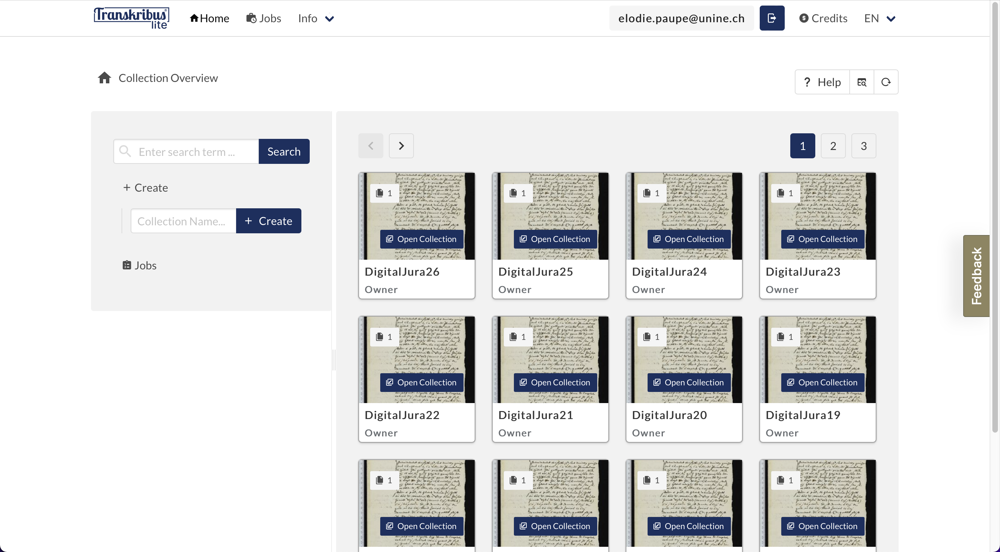 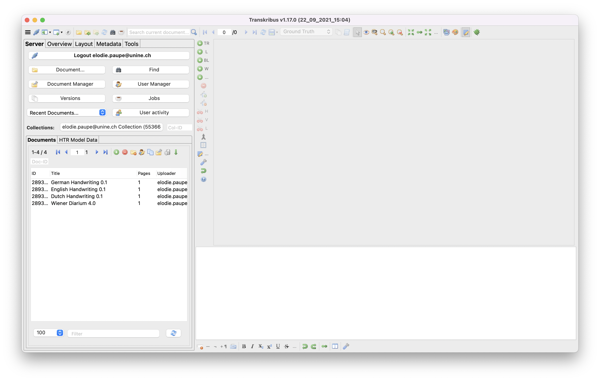

---
## Entrer dans une collection
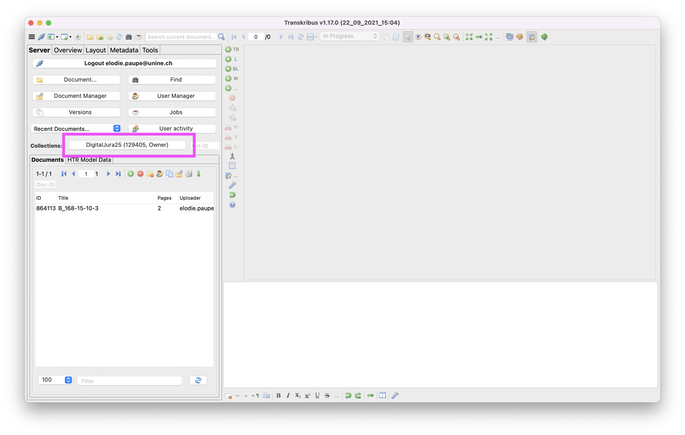

---
## Entrer dans un document 

---
## Reconnaissance de texte

---
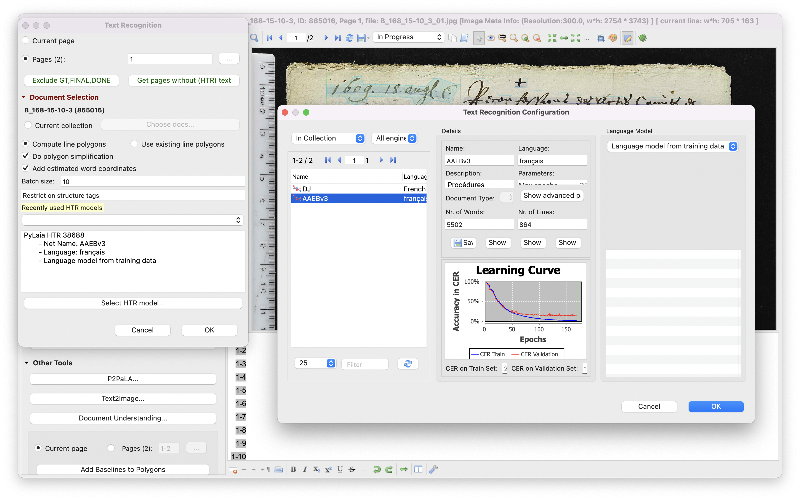

---

---
L'efficacité d'un modèle dépend 
* de la qualité du matériel d'apprentissage 
* de la qualité des images 
* de la netteté de l'écriture.

---
### AAEBv3

---
### Modèles publics

[Catalogue des modèles publics](https://readcoop.eu/transkribus/public-models/)

---

---
## Segmenter une page 

---
* La segmentation permet de relier l'image à la transcription. 

* Les coordonnées de chaque segment identifié sont stockés dans des fichiers PAGE qui peuvent être exportés. 

---

---
* L'ajustement de la segmentation dépend de l'objectif poursuivi: une segmentation plus fine augmente la précision.  

* L'ajustement de l'ordre des segments et des régions de texte n'a pas d'effet sur sur l'entraînement d'un modèle HTR. 

---

* +L 
* +BL pour la baseline

---

---
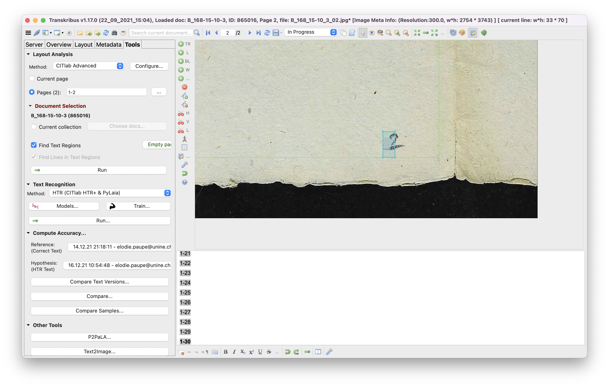

---
Une fois la page segmentée, lancer un moteur HTR comme tout à l'heure. 

---
## Charger une page
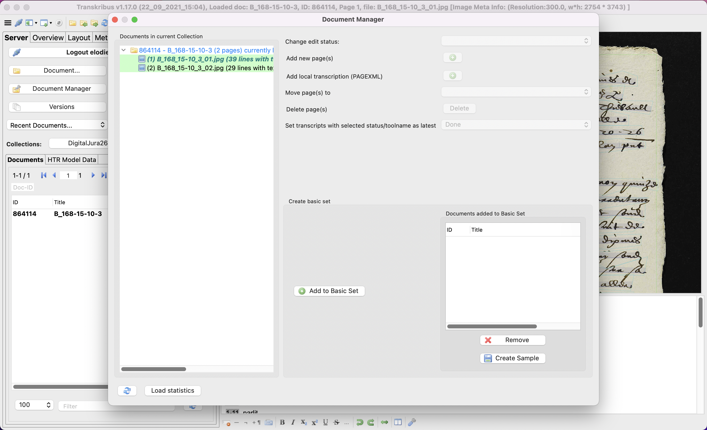

---
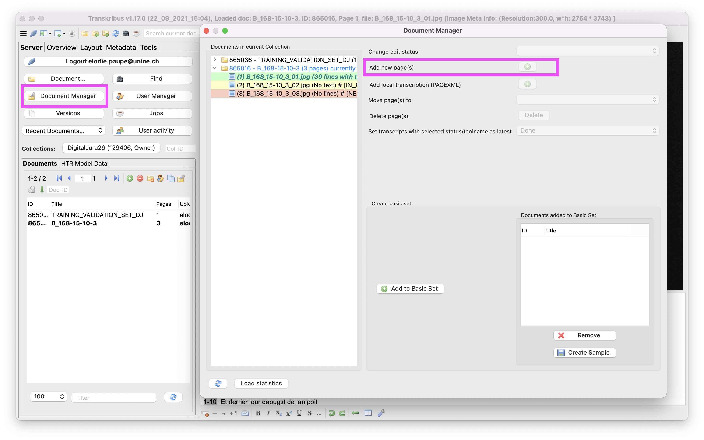

---
## Entraîner un modèle
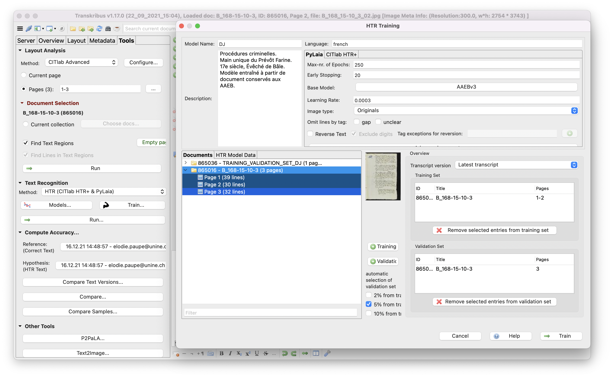

---
* La sélection des données de validations peut se faire manuellement ou aléatoirement sur un pourcentage du corpus. 
* En cas de sélection manuel, il faut veiller à sélectionner un corpus de validation différent du corpus d'entraînement. 
* Plus votre corpus de validation est large, plus l'entraînement prend du temps. 

---
* Pour entraîner un modèle manuscrit, il faut compter entre 5'000 et 15'000 mots de transcriptions accompagnées de leurs numérisations. 

* On peut entraîner un nouveau modèle avec un nombre plus limité de pages en ne partant pas de zéro, mais en s'appuyant sur un modèle public.

---
### PyLaia ou HTR+ ? 
* PyLaia: moteur _open source_ 
* HTR+ : moteur propriétaire

* Faire des tests en fonction des projets...
* Possibilité de faire appel à un modèle linguistique élaboré à partir des données dans les deux cas. 
* HTR+ plus efficace sur les lignes courbes.

---
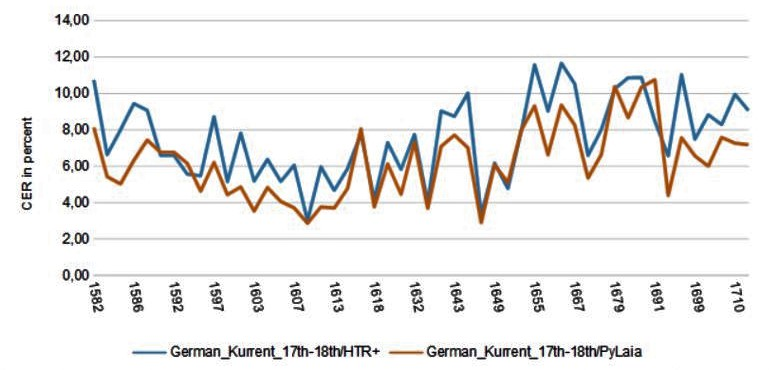
* PyLaia plus efficace pour les modèles génériques (Alvermann 2021)
* Différences mineures (Hodel, Schoch, Schneider and Purcell 2021)

--- 
On considère qu'un modèle est exploitable quand le taux d'erreur sur caractère (CER) est inférieur à 10%. 

---
## Le modèle AAEBv3
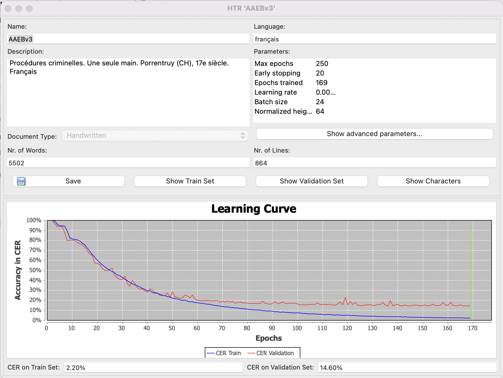

---
### Résultat sur un document tiers avec ou sans _langage model_
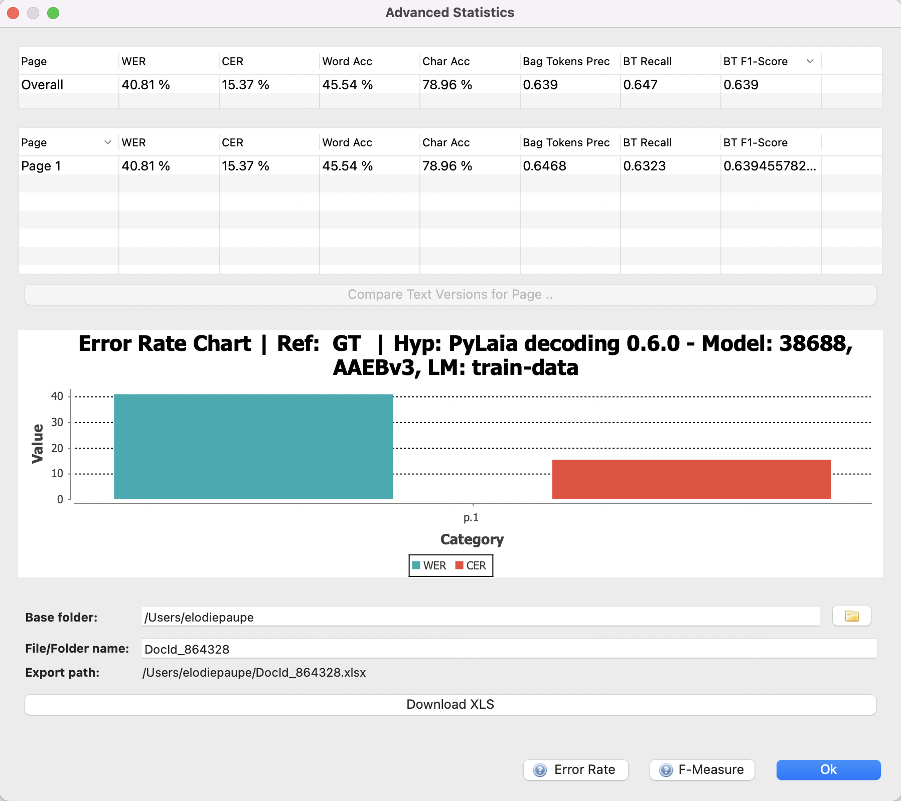 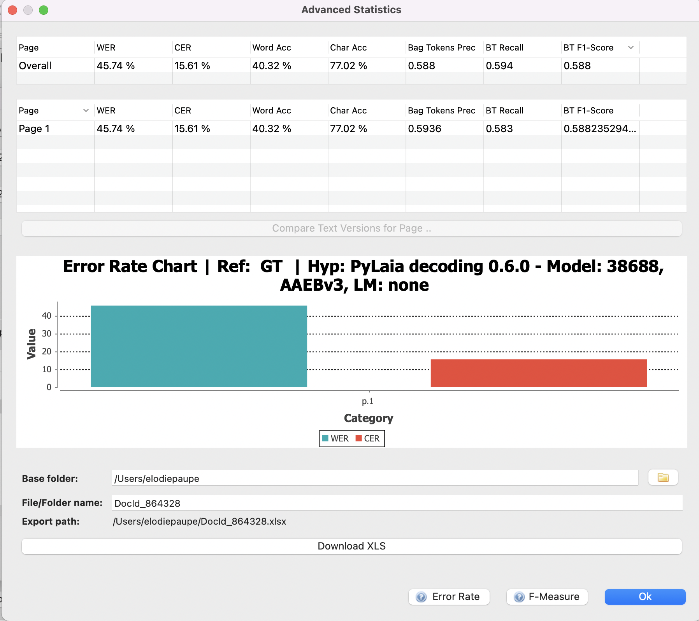

---
## Transcription avancée avec Transkribus
* ajuster l'ordre de lecture du texte
* utiliser des caractères historiques : caractères unicodes, écran virtuel sur le logiciel
* annoter la transcription en ajoutant des balises 
* ajouter des métadonnées

[Ressources complémentaires](https://readcoop.eu/transkribus/resources/how-to-guides/)

---
## La question du coût 
* L'inscription donne droit à 500 crédits gratuits. 
* La consommation des crédits dépend du moteur HTR utilisé (PyLaia ou HTR+) et du type de documents (manuscrit ou imprimé).

500 crédits = 500 pages manuscrites avec PyLaia
[Calculatrice](https://readcoop.eu/transkribus/credits/)

---
## Télécharger les transcriptions
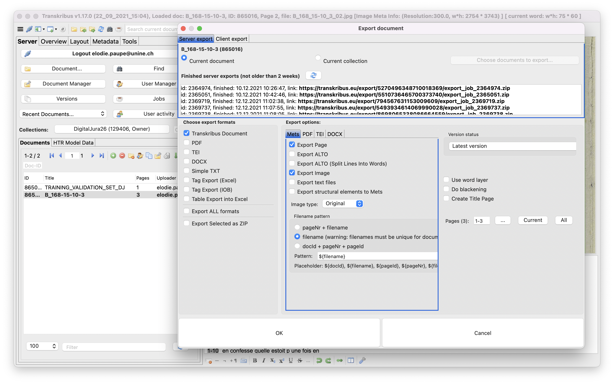

---